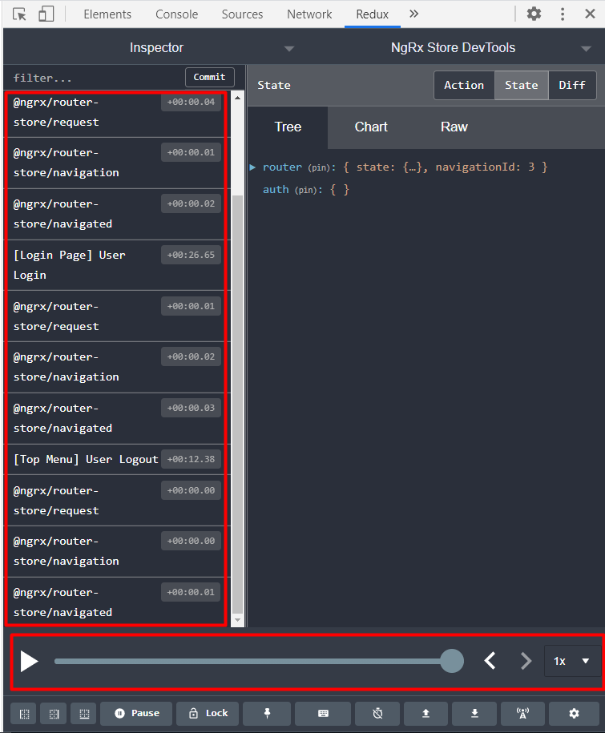
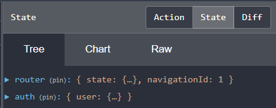

## 24. Настройка Router Store и Time-Travelling Debugger

**Time-Travelling Debugger** - это слайдер, который находится в DevTools, с помощью которого можно перемещаться по истории Actions, отслеживая как изменяется состояние приложения.   
В сочетании с **Router Store** - *Time-Travelling Debugger* позволяет отслеживать процесс смены URL, перемещаясь по истории Actions.




### 1. Установка и настройка router-store [ https://ngrx.io/guide/router-store/install ]

`ng add @ngrx/router-store@latest`   

В результате произойдут следующие изменения:   

- *package.json*:
```json
  "dependencies": {
    "@ngrx/router-store": "^10.0.1",
  },
```

- *src\app\app.module.ts*:
```js
import { RouterState, StoreRouterConnectingModule } from '@ngrx/router-store';
@NgModule({
  imports: [

		// StoreRouterConnectingModule принимает объект конфигурации:
		// 1й параметр - 'stateKey - в каком свойстве сохранять состояние роутера внутри store - в свойстве 'router'
		// 2й параметр - 'routerState' - в каком формате сохранять состояние роутера - Minimal или Full

		StoreRouterConnectingModule.forRoot({
			stateKey: 'router',
			routerState: RouterState.Minimal
		})
  ],
})
```

**StoreRouterConnectingModule** - cоединяет RouterState со Store.   
В результате вышеописанных действий, при переходах со страницы на страницу, router-store будет отправлять router navigation actions, которые должен обрабатывать соответствующий редюсер - **routerReducer** из библиотеки *'@ngrx/router-store'*. Данный редюсер нужно подключить в reducers-конфигурации *src\app\reducers\index.ts*:

```js
import { routerReducer } from '@ngrx/router-store';

// Ключи внутри reducers - это свойства state в store 
export const reducers: ActionReducerMap<AppState> = {

	// Ключ router соответствует значению ключа stateKey в файле src\app\app.module.ts, который мы задали выше 
	router: routerReducer
};
```

### 2. Проверка работы 

Теперь запустим приложение, и увидим, что в store появилось новое свойство router:



Также теперь с помощью *Time-Travelling Debugger*, перемещаясь по истории Actions, можно отслеживать процесс смены URL.