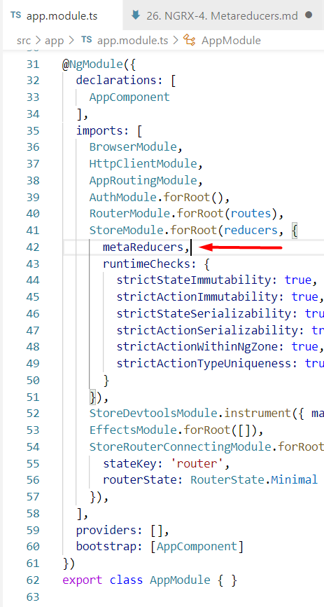

## 26. Metareducers

https://www.udemy.com/course/ngrx-course/learn/lecture/15513476#content     

**Metareducer** - функция, вызываемая сразу после возникновения action, но перед тем, как action будет передан глобальному редюсеру.   

### Создание Metareducer

В качестве примера создадим logger metareducer, который будет логировать текущий state и action.   
*src\app\reducers\index.ts*:

```js
// В качестве аргумента, metareducer принимает редюсер, который должен быть вызван после metareducer
export function logger(reducer: ActionReducer<any>): ActionReducer<any> {

	// Metareducer должен возвращать функцию, которая принимает два параметра: состояние и действие
	return (state, action) => {
		console.log('state before:', state);
		console.log('action:', action);

		// Metareducers не должны изменять передаваемые им состояние и действие!!!

		// Сама же функция должна возвращать вызов переданного редюсера
		return reducer(state, action);
	}
}

// Добавляем logger metareducer в массив metaReducers
export const metaReducers: MetaReducer<AppState>[] = !environment.production ? [logger] : [];
```

Массив metaReducers передается в свойство metaReducers в объект конфигурации, который передается вторым параметром методу StoreModule.forRoot() в файле src\app\app.module.ts:



На практике Metareducers чаще всего используются для логирования. Принцип работы Metareducer идентичен работе Middleware в Node.js.