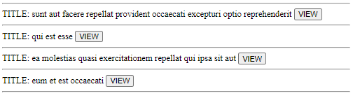
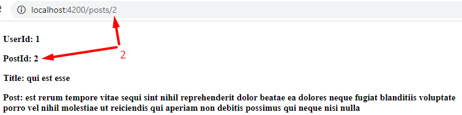

## 27. Отображение всех постов и выбранного поста

В этом уроке мы не будем затрагивать работу с NgRx. 

**Задача данного урока:**
- усовершенствовать логику отображения постов на странице `posts`
- добавить кнопку 'VIEW', с помощью которой мы сможем переходить на страницу выбранного поста:
	
- создать страницу, которая будет отображать выбранный пост:
	

### 1. Компонент posts-card-list - отображение всех постов

В уроке 6, отображение всех постов было реализовано внутри *home.component.html*. Перенесем данную работу в новый компонент *posts-card-list*.   
Для этого создаем новый компонент *src\app\posts\components\posts-card-list*, который содержит в себе 2 файла:

1. posts-card-list.component.js:
```js
import { Component, Input } from "@angular/core";
import { IPost } from "../../model/post.model";

@Component({
  selector: "nl-posts-card-list",
  templateUrl: "./posts-card-list.component.html"
})

export class PostsCardListComponent {
	// Получаем значение переменных allPosts и postsNumb из home.component
	@Input() allPosts: IPost[];
	@Input() postsNumb: number;
}
```

2. posts-card-list.component.html:
```html
<h1>Всего {{ postsNumb }} постов</h1>

<div *ngFor='let post of allPosts'>
	<hr>
	<h3>{{ post.description }}</h3>
	

	<button mat-raised-button color="primary" [routerLink]="['/posts', post.url]">
		VIEW
	</button>
</div>
```

Поскольку отображение постов перенесли из *home.component* в *posts-card-list.component*, то изменяем файл *src\app\posts\components\home\home.component.html*:
```html
<!-- Передаем значения переменных allPosts$ и numb из *home.component* в *posts-card-list.component* -->
<nl-posts-card-list
	[allPosts]="allPosts$ | async"
	[postsNumb]="numb"
>
```

### 2. Компонент post - отображение конкретного поста

Для отображения конкретного поста, создадим новый компонент - *src\app\posts\components\post*, который содержит в себе 2 файла:

1. src\app\posts\components\post\post.component.ts:
```js
import { Component } from "@angular/core";
import { ActivatedRoute } from '@angular/router';
import { Observable } from 'rxjs';
import { IPost } from '../../model/post.model';
import { PostsService } from '../../posts.service';

@Component({
  selector: "nl-post",
  templateUrl: "./post.component.html"
})

export class PostComponent {
	post$: Observable<IPost>;

	constructor(
		private route: ActivatedRoute,
		private postsService: PostsService
	) {}

	ngOnInit() {
		const postUrl = this.route.snapshot.paramMap.get("postUrl");
		this.post$ = this.postsService.findPostById(postUrl);
	}
}
```

2. src\app\posts\components\post\post.component.html:
```html
<div *ngIf="(post$ | async) as post">
	<h3>UserId: {{ post.userId }}</h3>
	<h3>postUrl: {{ post.id }}</h3>
	<h3>Title: {{ post.title }}</h3>
	<h3>Post: {{ post.body }}</h3>
</div>
```

Для данного компонента, необходимо создать метод *findPostById* внутри *postsService*, с помощью которого мы будем получать данные конкретного поста. 
Добавляем в *src\app\posts\posts.service.ts*:
```js
findPostById(postUrl: string): Observable<IPost> {
	return this.http.get<IPost>(`/api/courses/${postUrl}`);
}
```

### 3. Подключение новых компонентов в posts.module + создание роута для страницы "post"

Добавляем в *src\app\posts\posts.module.ts*:
```js
import { PostsCardListComponent } from './components/posts-card-list/posts-card-list.component';
import { PostComponent } from './components/post/post.component';

const postsRoutes: Routes = [
  // { path: '', component: HomeComponent },
  { path: ':postUrl', component: PostComponent },
];

@NgModule({
	// ...
	declarations: [
		// HomeComponent, 
		PostsCardListComponent,
		PostComponent
	],
	// ...
})
```