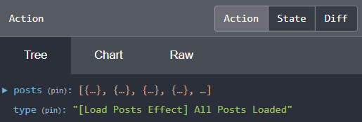

## 28. resolver, actions, effect, reducer для posts-страницы

На данный момент, **при каждом переходе на страницу *posts*, происходит обращение к серверу**, чтобы получить данные всех постов. Такая логика является не правильной, поскольку пользователь, находясь на странице *posts*, может переходить с неё на страницу выбранного поста и возвращаться обратно назад много раз, что будет приводить к большой нагрузке на сервер. Чтобы исправить такое поведение, нам необходимо после первого перехода на страницу *posts*, сохранить полученные от сервера данные в *store*, и при всех последующих переходах, считывать данные из *store*.

### 1. Создание 'router resolver' сервиса (часть 1)

Создадим новый файл *src\app\posts\posts.resolver.ts*, в котором мы реализуем особый тип сервиса - *router resolver*.   
**Router resolver** - это специальный сервис, который запускается до того, как router завершит переход на новую страницу.   
Если целевому компоненту требуются данные из серверной части, *Router resolver* - лучшее место для получения этих данных, поскольку router гарантирует, что целевой экран не отобразится до тех пор, пока данные не будут получены. Если что-то не так при получении данных с сервера - навигация по маршрутизатору будет отменена. 

В нашем приложении *router resolver* сервис будет запущен перед перед отображением экрана posts. Он будет выполнять следующее:
- проверит, есть ли необходимые нам данные внутри store
- если данных внутри store нету - запустит действие loadAllPosts, которое будет описано ниже

Поскольку получение данных от сервера и их сохранение в store еще не реализовано, наша задача сейчас - вызвать из *router resolver* действие loadAllPosts.

*src\app\posts\posts.resolver.ts*:
```js
import { loadAllPosts } from './posts.actions';
import { Observable } from 'rxjs';
import { Injectable } from "@angular/core";
import { Resolve, ActivatedRouteSnapshot, RouterStateSnapshot } from '@angular/router';
import { AppState } from '../reducers';
import { tap } from "rxjs/operators";
import { Store } from "@ngrx/store";

@Injectable()
// Resolver сервисы необходимо наследовать от Resolve класса
export class PostsResolver implements Resolve<any> { 

	constructor(
		// Чтобы получить доступ к данным из хранилища - инжектим Store
		private store: Store<AppState>
	) {}

	// Resolver сервис имеет один обязательный метод resolve(), который принимает несколько аргументов:
	// - route: ActivatedRouteSnapshot - содержит иформацию об текущем url
	// - state: RouterStateSnapshot - содержит текущий стейт роутера
	resolve(route: ActivatedRouteSnapshot, state: RouterStateSnapshot): Observable<any> {
		return this.store.pipe(
			tap(() => {
				// Вызов действия loadAllPosts()
				this.store.dispatch(loadAllPosts());
			})
		)
	}
}
```

### 2. Подключение 'router resolver' сервиса к posts.module

*src\app\posts\posts.module.ts*:
```js
// ...
import { PostsResolver } from './posts.resolver';

const postsRoutes: Routes = [
	{ 
		// path: '', 
		// component: HomeComponent, 

		// Чтобы сообщить роутеру, что перед переходом на HomeComponent необходимо обработать резолвер -
		// его необходимо подключить следующим образом:
		resolve: {
			posts: PostsResolver
		} 
	},

  // { path: ':postId', component: PostComponent },
];

// ...

@NgModule({
	// ...
	providers: [
		// PostsService,
		PostsResolver
  ]
})
export class PostsModule {
}
```

### 3. Создание 'loadAllPosts' action

В случае, если данные от сервера не сохранены в store, резолвер (см. пункт 1) будет вызывать *loadAllPosts* действие.   
**Задача *loadAllPosts* действия** - давать команду, что началась загрузка данных с сервера. 

Внутри модуля posts, создаем файл *src\app\posts\posts.action.ts*, внутри которого создаем *loadAllPosts* действие:
```js
import { createAction } from '@ngrx/store';

// loadAllPosts - это действие будет вызвано в 'src\app\posts\posts.resolver.ts' в случае, если данные от сервера не сохранены в store.
// Оно будет вызвано до того, как будет выполнен переход на страницу posts, чтобы не показывать пользователю пустой экран
export const loadAllPosts = createAction(
	// [Posts Resolver] - место, где происходит action
	// Load All Posts - событие, с помощью которого мы информируем store о том, что началась загрузка постов с сервера
	'[Posts Resolver] Load All Posts'
) 
```

### 4. Создание 'loadPosts$' effect

**Effect** — функция изменения состояния данных, которая прослушивает отправленные в хранилище actions, проверяет имеется ли у нее обработчик для этих actions, и, если обработчик имеется, выполняет определенную работу и возвращает новые action в reducer.

Наша задача - создать эффект *loadPosts$*, который будет выполнять следующее:
- перехват созданного в п.3 действия *loadAllPosts* и выполнение запроса к серверу для получения постов
- запуск действия loadAllPosts, передавая ему в качестве payload - полученные от сервера данные (loadAllPosts будет описано ниже)

Создаем файл *src\app\posts\posts.effects.ts*:
```js
import { allPostsLoaded } from './posts.actions';
import { PostsService } from './posts.service';
import { Injectable } from '@angular/core';
import { Actions, createEffect, ofType } from '@ngrx/effects';
import { PostsActions } from './action-types';
import { map, mergeMap } from 'rxjs/operators';

// Классы эффектов не инжектятся в другие места приложения, как это можно делать с классами сервисов.

@Injectable()
export class PostsEffects {

	// createEffect() - принимает функцию, которая возвращает observable
	loadPosts$ = createEffect(
		() => this.action$.pipe(

			// ofType - используется для фильтрации действий по их типу -
			// при возникновении loadAllPosts действия -
			// будет выполнен запрос к серверу для получения данных
			ofType(PostsActions.loadAllPosts),
			mergeMap(action => this.postHttpService.findAllPosts()),

			// После получения данных от сервера - отправляем новый action - allPostsLoaded,
			// передавая ему в качестве payload - полученные от сервера данные
			map(posts => allPostsLoaded({posts}))

		)
	)

	// Инжектим сервис Actions, который является частью библиотеки ngrx/effects
	constructor(
		private action$: Actions, 
		private postHttpService: PostsService
	){}

}
```

### 5. Подключение 'loadPosts' эффекта к posts.module

*src\app\posts\posts.module.ts*:
```js
import { EffectsModule } from '@ngrx/effects';
import { PostsEffects } from './posts.effects';

@NgModule({
	imports: [
		// CommonModule,
		// RouterModule.forChild(postsRoutes),
		EffectsModule.forFeature([PostsEffects]),
	],
	// ...
})
```

### 6. Создание 'allPostsLoaded' action

В случае, если данные от сервера были получены с помощью эффекта *loadPosts$* (п. 4), он отправит новое действие - *allPostsLoaded*.      
**Задача *allPostsLoaded* действия** - проинформировать store о том, что получены данные от сервера.

Внутри файла *src\app\posts\posts.action.ts* создаем *allPostsLoaded* действие:
```js
import { props } from '@ngrx/store';
import { IPost } from "./model/post.model";

export const allPostsLoaded = createAction(
	// [Load Posts Effect] - место, где происходит action
	// All Posts Loaded - событие, с помощью которого мы информируем store о том, что загружены все посты
	'[Load Posts Effect] All Posts Loaded',
	props<{posts: IPost[]}>()
) 
```

### 7. Action-групировка 

Теперь, в файле *src\app\posts\posts.action.ts*, мы имеем два разных action - loadAllPosts и allPostsLoaded, которые логически связаны с получением постов от сервера. Хорошей практикой является групировать логически связанные actions, чтобы облегчить доступ к ним.   
Для этой задачи создаем новый файл *src\app\posts\action-types.ts* в который импортируем все actions в PostsActions, а затем экспортим PostsActions:
```js
import * as PostsActions from './posts.actions';
export { PostsActions };
```

### 8. Проверяем, что 'allPostsLoaded' action попал в store

- Переходим во вкладку 'devtools --> Redux' 
- В левой части экрана выбираем action - '[Load Posts Effect] All Posts Loaded'
- Нажав на него, во вкладке 'Action --> Tree' увидим объект, который содержит данные постов, которые мы получили с сервера, а также тип нашего action:       
	     
	Если же мы переключимся во вкладку 'State --> Tree', то мы увидим только раннее сохраненные данные:     
	      
	Так происходит потому, что задача action - проинформировать store, что что-то произошло на уровне компонента. А чтобы изменить состояние store, мы должны добавить в приложение редюсер. Об этом далее.

### 9. Создание редюсера для posts-страницы

Создаем новый файл *src\app\posts\reducers\posts.reducers.ts*:

УРОК 29

`npm i @ngrx/entity --save`
https://xsltdev.ru/angular/ngrx/entity-state/