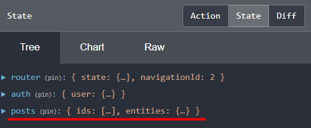

## 29. entity state, adapter, reducer для posts-страницы

### 1. Что такое Entity

В NgRx мы храним различные типы состояний в store, например:
- бизнес-данные, такие как, курсы или уроки, в случае платформы онлайн-курсов
- некоторое состояние пользовательского интерфейса

**Entity (сущность)** - это бизнес-данные, поэтому Курс и Урок являются примерами entity.

**Entity State формат** - это формат состояния, который хранит идентификаторы сущностей в массиве (ids), а сами сущности - в объекте (entities), в котором ключ - идентификатор сущности, а значение - сама сущность.   

Ниже приведен код EntityState-интерфейса:
```js
interface EntityState<V> {
	ids: string[] | number[];
	entities: { [id: string | id: number]: V };
}
```

Ниже приведен пример объекта в store в Entity State формате:
```js
{
	courses: {
		ids: [0, 1],
		entities: {
			0: {
				id: 0,
				description: "Angular Ngrx Course",                   
			},
			1: {
				id: 1,
				description: "Angular for Beginners",                                          
			},
		}
	},
	lessons: {
		ids: [1, ... 35],
		entities: {
			1: {
				id: 1,
				"description": "Angular Tutorial For Beginners - Build Your First App - Hello World Step By Step",
			},
			....
			35: {
				id: 35,
				"description": "Unidirectional Data Flow And The Angular Development Mode",
			}
		}
	}
}
```

### 2. NgRx Entity

**NgRx Entity** - это библиотека, которая помогает хранить сущности (entities) в формате Entity State (массив идентификаторов и объект сущностей). 

Установка:    
`npm i @ngrx/entity --save`

### 3. NgRx Adapter

**Adapter** - это класс, который предоставляет ряд функций, которые упрощают управление entity state в store.   
Адаптер позволяет гораздо проще создавать: начальное состояние сущности, редукторы, селекторы, выполнять CRUD операции в store, сохраняя нашу сущность в формате EntityState.

### 4. Создание postsReducer для posts-страницы

Создаем новый файл, который будет содержать редюсер *src\app\posts\reducers\posts.reducers.ts*:
```js
import { IPost } from './../model/post.model';
import { createEntityAdapter, EntityState } from '@ngrx/entity';
import { createReducer, on } from '@ngrx/store';
import { PostsActions } from '../action-types';

// Интерфейс PostsState - соответствует Entity State формату:
// export interface PostsState {
// 	ids: string[] | number[];
// 	entities: {[key:string]: IPost},
// }

// Интерфейс PostsState, закоментированный выше, можно написать проще, используя класс EntityState:
export interface PostsState extends EntityState<IPost> {}

// Создаем адаптер с помощью метода createEntityAdapter:
export const adapter = createEntityAdapter<IPost>();

// Создаем начальное состояние posts-модуля с помощью метода getInitialState.
// В результате вызова adapter.getInitialState(),
// переменная initialPostsState будет хранить пустой массив ids и пустой объект entities
export const initialPostsState = adapter.getInitialState();

// Создаем редюсер с помощью метода createReducer.
// Данный рудюсер слушает allPostsLoaded action и он должен
// сохранять посты в store в Entity State формате
export const postsReducer = createReducer(
	initialPostsState,
	on(
		PostsActions.allPostsLoaded,
		// Следующий метод 1м аргументом принимает предыдущий state, вторым - action,
		// возвращает в store новую версию состояния в Entity State формате:
		(state, action) => adapter.addMany(action.posts, state) 
	)
)
```

### 5. Подключение postsReducer в posts.module 

Добавляем в *src\app\posts\posts.module.ts*:
```js
import { postsReducer } from './reducers/posts.reducers';
import { StoreModule } from '@ngrx/store';

@NgModule({
	imports: [
		// ...
		EffectsModule.forFeature([PostsEffects]),
		StoreModule.forFeature('posts', postsReducer),
	],
	// ...
})
```

### 6. Проверяем, что состояние store изменилось

Переходим во вкладку 'devtools --> Redux --> State':    



