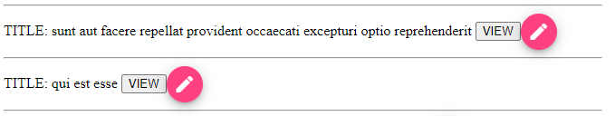

## 33. Material кнопка

Задача урока - на странице 'http://localhost:4200/posts', для каждого поста добавить кнопку EDIT, с помощью которой мы будем открывать окно для редактирования содержимого поста. 

### 1. Подключаем angular/material в posts.module

Подключаем модули кнопок и иконок, которые будем использовать внутри кнопок *src\app\posts\posts.module.ts*:
```js
import { MatButtonModule } from '@angular/material/button';
import { MatIconModule } from '@angular/material/icon';
@NgModule({
  imports: [
		MatButtonModule,
		MatIconModule,
  ],
})
``` 

### 2. Добавляем кнопку на страницу

Добавляем в *src\app\posts\components\posts-card-list\posts-card-list.component.html*:
```html
<!-- <div *ngFor='let post of allPosts'> -->
  <!-- ... -->

	<button mat-mini-fab>
		<mat-icon (click)="editPost(post)">edit</mat-icon>
	</button>
  
<!-- </div> -->
```

Где:
- `<button mat-mini-fab></button>` - добавит на страницу круглую кнопку
- `<mat-icon>edit</mat-icon>` - добавит внутрь кнопки иконку edit

Добавляем в *src\app\posts\components\posts-card-list\posts-card-list.component.ts*:
```js
export class PostsCardListComponent {
  // ...

	editPost(post: IPost) {
		console.log(post)
	}
}
```

В результате имеем следующее:   


Инфо о кнопках: https://material.angular.io/components/button/overview    
Список иконок: https://www.angularjswiki.com/angular/angular-material-icons-list-mat-icon-list/#angular-material-icons-list-categories