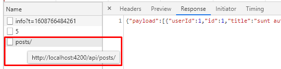
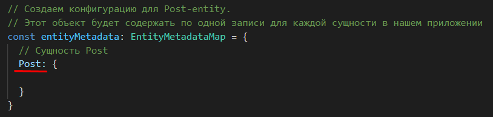
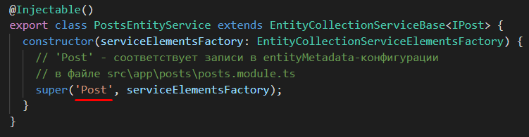
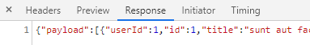
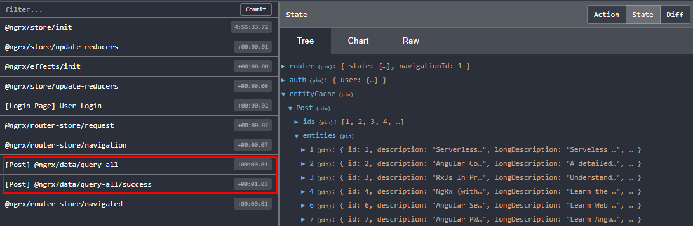

## 39. Получение данных от сервера, resolver, getAll

В этом уроке, используя NgRx-Data, мы будем получать данные от сервера и сохранять их в store.   

### 1. Создание 'router resolver' сервиса

Создадим новый файл *src\app\posts\posts.resolver.ts*, в котором мы реализуем особый тип сервиса - *router resolver*.   
**Router resolver** - это специальный сервис, который запускается до того, как router завершит переход на новую страницу.   
Если целевому компоненту требуются данные из серверной части, *Router resolver* - лучшее место для получения этих данных, поскольку router гарантирует, что целевой экран не отобразится до тех пор, пока данные не будут получены. Если что-то не так при получении данных с сервера - навигация по маршрутизатору будет отменена. 

В нашем приложении *router resolver* сервис будет запущен перед перед отображением экрана posts. Он будет выполнять следующее:
- проверит, есть ли необходимые нам данные внутри store (эта логика будет реализована в следующем уроке)
- если данных внутри store нету - с помощью getAll-метода отправит запрос на сервер и сохранит в store полученные данные

Создадим 'resolver' сервис в файле *src\app\posts\posts.resolver.ts*:
```js
import { Injectable } from "@angular/core";
import { Resolve, ActivatedRouteSnapshot, RouterStateSnapshot } from '@angular/router';
import { Observable } from 'rxjs';
import { map } from "rxjs/operators";
import { PostsEntityService } from "./posts-entity.service";

@Injectable()
// Resolver сервисы необходимо наследовать от Resolve класса
export class PostsResolver implements Resolve<boolean> { 
  
  constructor(
    // Для получения данных с сервера мы будем использовать PostsEntityService
    private postsEntityService: PostsEntityService
  ) {}

  // Resolver сервис имеет один обязательный метод resolve(), который принимает несколько аргументов:
  // - route: ActivatedRouteSnapshot - содержит иформацию об текущем url
  // - state: RouterStateSnapshot - содержит текущий стейт роутера
  resolve(route: ActivatedRouteSnapshot, state: RouterStateSnapshot): Observable<boolean> {

    // Метод getAll входит в состав EntityService - он выполняет get-запросы
    // и сохраняет полученный от сервера результат в store
    return this.postsEntityService.getAll()
      .pipe(
        // Мы указали, что данный Observable должен вернуть boolean,
        // то-есть когда будет возвращено true - route-переход сможет завершить работу.
        // Переводим значение в boolean:
				// если в posts есть данные - получим true, если нет - false
        map(posts => !!posts)
      )
  }

}
```

Подключаем резолвер в *src\app\posts\posts.module.ts*:
```js
import { PostsResolver} from './posts.resolver';

const postsRoutes: Routes = [
  { 
    // path: '', 
    // component: HomeComponent, 

    // Чтобы сообщить роутеру, что перед переходом на HomeComponent необходимо обработать резолвер -
    // его необходимо подключить следующим образом:
    resolve: {
      posts: PostsResolver
    }
  },
  // ...
];

@NgModule({
  providers: [
    PostsResolver,
  ]
})
```

### 2. Метод getAll

После того, как мы создали и подключили resolver, который должен извлекать и сохранять данные в store, мы, переходя на страницу post, ожидаем увидеть данные на экране, но их нет. Разберем в чем причина.      
Внутри resolver было выполнено обращение к серверу с помощью getAll-метода, но мы не указали по какому пути производить запрос. Но если мы перейдем в консоль, мы увидим, что запрос все-таки произошел по адрессу http://localhost:4200/api/posts/ и даже был получен ответ:     


**Как метод getAll решил по какому адрессу выполнять get-запрос?**    
getAll выполняет запросы по специальной конвенции. Он считает, что по умолчанию вы работаете с rest-api, поэтому getAll строит ссылку самостоятельно так:    

`'хост+порт/' + 'api/' + 'entity' + 's/'`  

Значение *entity* соответствует:
- значению из entityMetadata в src\app\posts\posts.module.ts:
  
- значению из src\app\posts\posts-entity.service.ts:
  

То-есть, в нашем случаи метод getAll построил адресс http://localhost:4200/api/posts/ и отправил успешный запрос, но данные не отобразились на экране. Этому 2 причины:
- данные с сервера, при использовании getAll, должны приходить в виде массива, а в нашем случаи мы получили такую структуру:
  
- ссылка, которую построил getAll, не верная. Мы должны стучаться по адрессу http://localhost:4200/api/courses/ за правильными данными

Итак, исходя из описанных выше проблем, нам необходимо научиться:
- как преобразовывать полученные от сервера данные в массив
- как задавать для getAll ссылку самостоятельно
В этом нам поможет data-сервиса

### 3. Создание data-сервиса

Задача нашего data-сервиса - изменить стандартное поведение getAll-метода.  
Подобного рода сервисы нужны, когда rest api не соответствует конвенции, по которой работает ngrx/data (см. пункт выше). Поэтому, чтобы избежать написания подобного рода сервисов - рекомендуется строить API в соответствии с ngrx/data конвенцией.

*src\app\posts\posts-data.service.ts*:
```js
import { Injectable } from "@angular/core";
import { HttpClient } from "@angular/common/http";
import { Observable } from "rxjs";
import { IPost } from "./model/post.model";
import { DefaultDataService, HttpUrlGenerator } from "@ngrx/data";
import { map } from "rxjs/operators";

@Injectable()
export class PostsDataService extends DefaultDataService<IPost> {

  constructor(
    http: HttpClient, 

    // С помощью HttpUrlGenerator мы предоставляем ngrx/data
    // кастомный url для нашего API
    httpUrlGenerator: HttpUrlGenerator,
  ) {
    // 'Post' - имя entity, который определен в 
    // src\app\posts\posts.module.ts в entityMetadata
    super('Post', http, httpUrlGenerator);
  }

  // выполняем over-write метода getAll, перезатирая его стандартное поведение
  getAll(): Observable<IPost[]> {
    // '/api/courses' - кастомный url по которому стучаться при работе с 'Post' entity
    return this.http.get<IPost[]>('/api/courses')
      .pipe(
        // Трансформируем результат полученный с бека в массив
        map(res => res['payload'])
      )
  }
}
```

Подключаем data-сервис в *src\app\posts\posts.module.ts*:
```js
import { PostsDataService} from './posts-data.service';
@NgModule({
  // ...
  providers: [
    PostsDataService,
  ]
})
export class PostsModule {
  constructor(
    // private eds: EntityDefinitionService,

    // entityDataService - с помощью данного сервиса можно 
    // регистрировать data-сервисы для наших entity
    private entityDataService: EntityDataService,

    // data-сервис, который мы создали для обращений к бекенду
    private postsDataService: PostsDataService,
  ) {
    // eds.registerMetadataMap(entityMetadata);

    // Указываем, что postsDataService необходимо использовать при обращение к бекенду,
    // вместо того, чтоб использовать стандартное поведение ndrx/data 
    entityDataService.registerService('Post', postsDataService);
  }
}
```

### 4. Проверяем, получены ли данные с бека и сохранены ли они в store

Итак, с помощью ngrx/data мы можем получать данные с сервера и сохранять их в store, не используя при этом actions, reducers, effects и http-services, а также без написания большого колличества кода.   

В redux-консоли, помимо данных в store, мы можем видим 2 экшена, которые были запущены ngrx/data автоматически:
- *query-all* - получение данных с бека
- *query-all/success* - сохранение данные в store


