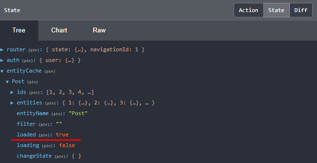

## 40. resolver, флаг loaded

Resolver, который мы создали в предыдущем уроке, срабатывает каждый раз при переходе на страницу http://localhost:4200/posts. Это значит, что getAll-метод внутри resolver'а тоже будет постоянно срабатывать, выполнять запрос на бек и сохранять данные в store, даже если до этого данные уже были сохранены в store. Такая логика является ресурсо-затратной. 

**Задача урока - предотвратить срабатывание getAll-метода внутри resolver'а, если данные в store уже существуют.**

### 1. Флаг loaded

Перейдем в `devTools --> Redux --> State`, когда в state есть данные, и мы увидим флаг `loaded` со значением `true` - это значит, что в store были сохранены данные:   
    
Мы будем использовать этот флаг для реализации поставленной задачи.

### 2. Переписываем логику resolver, используя флаг loaded

*src\app\posts\posts.resolver.ts*:
```js
import { filter, map, tap, first } from "rxjs/operators";

@Injectable()
// Resolver сервисы необходимо наследовать от Resolve класса
export class PostsResolver implements Resolve<boolean> { 
  
  // ...

  // Resolver сервис имеет один обязательный метод resolve(), который принимает несколько аргументов:
	// - route: ActivatedRouteSnapshot - содержит иформацию об текущем url
	// - state: RouterStateSnapshot - содержит текущий стейт роутера
	resolve(route: ActivatedRouteSnapshot, state: RouterStateSnapshot): Observable<boolean> {

    // С помощью PostsEntityService получаем доступ к флагу loaded
    return this.postsEntityService.loaded$
      .pipe(
        tap(loaded => {
          // Если флаг loaded == false - это значит, что данные еще не  
          // скачанные в store и сработает getAll-метод,
          // который выполнит запрос на сервер и сохранит результат в store
          if (!loaded) {
            this.postsEntityService.getAll();
          }
        }),
        // Мы указали, что Observable метода resolve должен вернуть boolean,
        // то-есть только когда будет возвращено true - route-переход сможет завершить работу.
        // Здесь filter гарантирует, что мы дождемся загрузки данных в хранилище.
        // Переводим значение в boolean:
        // если в loaded есть данные - получим true, если нет - false
        filter(loaded => !!loaded),
        // Метод first() возвратит первое полученное из потока значение,
        // и завершит Observable
        first()
      )
  }

}
```

