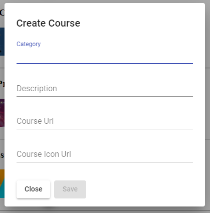
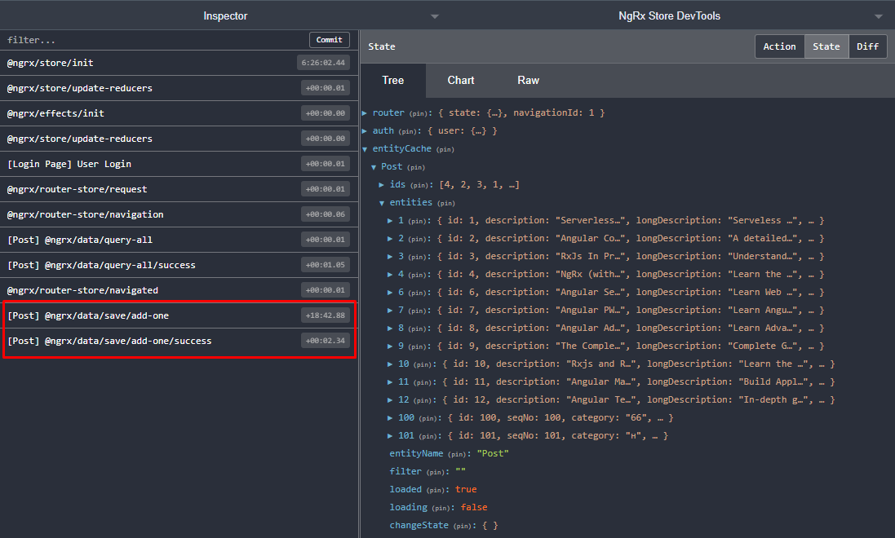

## 43. Добавление данных

Задача урока - создать функционал добавления нового поста:
- кнопка, с помощью которой будет открываться окно для добавления нового поста  
- окно для добавления нового поста:
    

При создании окна для добавления нового поста, мы будем использовать ранее созданный компонент "edit-post-dialog", добавив в него несколько новых полей.

### 1. Создание кнопки 'Add post'

С помощью кнопки 'Add post' мы будем добавлять новые посты.

Добавить в *src\app\posts\components\home\home.component.html*:
```html
<div class="header">
	Добавить новый пост 
	<button mat-mini-fab>
		<mat-icon (click)="onAddCourse()">add</mat-icon>
	</button>
</div>

<!-- ... -->
```

Добавить в *src\app\posts\components\home\home.component.ts*:
```js
import { defaultDialogConfig } from '../../shared/default-dialog-config';
import { MatDialog } from '@angular/material/dialog';
import { EditPostDialogComponent } from "../edit-post-dialog/edit-post-dialog.component";

export class HomeComponent {
  // ...

	constructor(
    // ...

    // При создании окна добавления нового поста
    //  мы будем использовать MatDialogModule
		private dialog: MatDialog,
  ) {}
  
    onAddCourse() {
		// В dialogConfig получаем базовые настройки нашего окна редактирования
    const dialogConfig = defaultDialogConfig();

		// Записываем в dialogConfig.data данные, которые мы хотим передать 
		// edit-post-dialog компоненту, который содержит material-модуль MatDialog
		// (https://material.angular.io/components/dialog/overview)
    dialogConfig.data = {
      dialogTitle:"Create Course",
      mode: 'create'
    };

		// Метод open - будет вызван, когда пользователь откроет окно:
    // 1й параметр - компонент, который необходимо отобразить при открытии окна
    // 2й параметр - объект с настройками  и данными
    this.dialog.open(EditPostDialogComponent, dialogConfig);
  }
}
```

### 2. Создание окна добавления нового поста

Добавить в *src\app\posts\components\edit-post-dialog\edit-post-dialog.component.html*:
```html
<!-- <mat-dialog-content> -->
  <!-- <ng-container *ngIf="form"> -->

    <!-- <ng-container [formGroup]="form"> -->
      <!-- ... -->

      <ng-container *ngIf="mode == 'create'">
        <mat-form-field>
          <input 
            matInput              
            placeholder="Course Url"
            formControlName="url"
          >
        </mat-form-field>
        <mat-form-field>
          <input 
            matInput
            placeholder="Course Icon Url"
            formControlName="iconUrl"
          >
        </mat-form-field>
      </ng-container>

    <!-- </ng-container> -->

  <!-- </ng-container> -->
<!-- </mat-dialog-content> -->
```

Добавить в *src\app\posts\components\edit-post-dialog\edit-post-dialog.component.ts*:
```js
export class EditPostDialogComponent {
  constructor(
    // ... 
  ) {
    // ...

    // if (this.mode == 'update') {
    //   this.form = this.fb.group(formControls);
    //   this.form.patchValue({...data.post});
    } else if (this.mode == 'create') {
      this.form = this.fb.group({
        ...formControls,
        url: ['', Validators.required],
        iconUrl: ['', Validators.required]
      });
    }  
  }

  onSave() {
    // const post: IPost = {
    //   ...this.post,
    //   ...this.form.value
    // };

    // if (this.mode === 'update') {
    //   this.postsEntityService.update(post);
    //   this.dialogRef.close();
    } else if (this.mode === 'create') {
      // Метод add входит в состав EntityService - он выполняет post-запросы к серверу
      // (add строит url запроса по специальной конвенции - но в нашем случаи
      // - необходимо задать кастомный url - см. post-data.service),
      // и сохраняет обновленные данные в store
      this.postsEntityService.add(post)
        .subscribe(
          newPost => {
            console.log('New post', newPost);
            this.dialogRef.close();
          }
        )
    }
  }

}
```

### 3. Изменяем стандартное поведение NGRX/DATA-add метода

*src\app\posts\posts-data.service.ts*:
```js
export class PostsDataService extends DefaultDataService<IPost> {
  // ...

  // выполняем over-write метода add, перезатирая его стандартное поведение
  add(newPost): Observable<IPost> {
    // `/api/course/` - кастомный url 
    return this.http.post<IPost>(`/api/course/`, newPost);
  }
}
```

### 4. Проверяем, получены ли данные с бека и сохранены ли они в store   

В redux-консоли, помимо данных в store, мы можем видим 2 экшена, которые были запущены ngrx/data автоматически:
- *save/add-one* - данный экшен был запущен, когда была тригернута операция сохранения
- *save/add-one/success* - когда post-запрос прошел успешно и данные были сохранены в store


