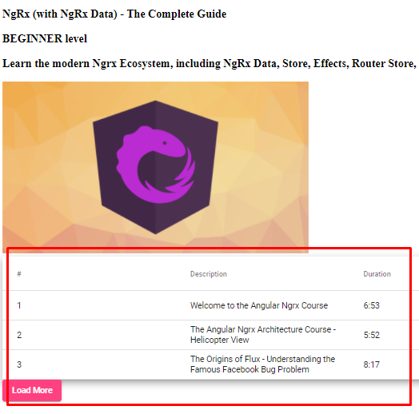

## 46. Пагинация 

При клике на кнопку VIEW одного из постов на странице http://localhost:4200/posts мы переходим на страницу с детальной информацией о посте, например http://localhost:4200/posts/ngrx-course. Задача данного урока - добавить на эту страницу с детальной информацией - отображение списка уроков с пагинацией:    

    

### 1. Добавляем angular-material верстку 

С помощью angular-material необходимо добавить на страницу верстку как на картинке выше.      

Добавляем в *src\app\posts\components\post\post.component.html*:
```html
<!-- <div *ngIf="(post$ | async) as post"> -->
	<!-- 
	<h3>{{ post?.description }}</h3>
	<h3>{{ post?.category }} level</h3>
	<h3>{{ post?.longDescription }}</h3>
	 
	-->

	<mat-table class="mat-elevation-z8" [dataSource]="lessons$ | async">
		<ng-container matColumnDef="seqNo">
			<mat-header-cell *matHeaderCellDef>#</mat-header-cell>
			<mat-cell *matCellDef="let post">{{post.seqNo}}</mat-cell>
		</ng-container>
		<ng-container matColumnDef="description">
			<mat-header-cell *matHeaderCellDef>Description</mat-header-cell>
			<mat-cell *matCellDef="let post">{{post.description}}</mat-cell>
		</ng-container>
		<ng-container matColumnDef="duration">
			<mat-header-cell *matHeaderCellDef>Duration</mat-header-cell>
			<mat-cell *matCellDef="let post">{{post.duration}}</mat-cell>
		</ng-container>
		<mat-header-row *matHeaderRowDef="displayedColumns"></mat-header-row>
		<mat-row *matRowDef="let row; columns: displayedColumns"></mat-row>
	</mat-table>

	<button 
		mat-raised-button 
		color="accent"
		(click)="loadLessonsPage(post)"
	>Load More</button>

<!-- </div> -->

<!-- При true - спинер должен отображаться -->
<div class="spinner-container" *ngIf="(loading$ | async)">
	<mat-spinner></mat-spinner>
</div>
```

Чтобы реализовать верстку выше, подключим необходимые angular-material компоненты в *src\app\posts\posts.module.ts*:  
```js
import { MatTableModule } from '@angular/material/table';
import { MatPaginatorModule } from '@angular/material/paginator';

@NgModule({
	imports: [
		// ...
		MatTableModule,
		MatPaginatorModule,
	],
	// ...
})
```

### 2. Добавляем логику отображения списка уроков с пагинацией

*src\app\posts\components\post\post.component.ts*:
```js
import { Component } from "@angular/core";
import { ActivatedRoute } from '@angular/router';
import { Observable } from 'rxjs';
import { IPost } from '../../model/post.model';
import { delay, map, tap, withLatestFrom } from 'rxjs/operators';
import { PostsEntityService } from "../../posts-entity.service";
import { LessonsEntityService } from "../../lessons-entity.service";
import { ILesson } from "../../model/lesson";

@Component({
  selector: "nl-post",
  templateUrl: "./post.component.html"
})

export class PostComponent {
	loading$: Observable<boolean>;
	post$: Observable<IPost>;
	lessons$: Observable<ILesson[]>;
	displayedColumns = ['seqNo', 'description', 'duration'];
	nextPage = 0;

  constructor(
		private route: ActivatedRoute,
		// С помощью PostsEntityService мы будем получать данные из store
		private postsEntityService: PostsEntityService,

		// С помощью LessonsEntityService мы будем обращаться
		// к серверу и сохранять данные в store
		private lessonEntityService: LessonsEntityService,
	) {}
	
	ngOnInit() {
		const postUrl = this.route.snapshot.paramMap.get("postUrl");
		// this.post$ = this.postsService.findPostById(postUrl);

		// Получение данных из store с использованием entity-сервиса
		// Внутри postsEntityService метода существует метод entities$ -
		// это observable, который эмитит данные как только данные
		// появились в store
		// Внутри this.postsEntityService.entities$ находятся все посты
		this.post$ = this.postsEntityService.entities$
			.pipe(
				tap(posts => console.log('posts', posts)),
				// При первом совпадении post.url == postUrl ->
				// результат будет присвоен в this.post$
				map(posts => posts.find(post => post.url == postUrl))
			)

		// Получение данных из store с использованием entity-сервиса
		// Внутри lessonEntityService метода существует метод entities$ -
		// это observable, который эмитит данные как только данные
		// появились в store.
		// Внутри this.lessonEntityService.entities$ находятся все уроки
		this.lessons$ = this.lessonEntityService.entities$
			.pipe(
				// Получить данные постов можно обратившись к post$ observable.
				// Чтобы внутри текущего lessons$ observable обратиться к 
				// данным другого observable - используем rxjs-метод withLatestFrom - 
				// данный метод делает микс двух observable и создает новый observable
				// который эмитит пары значений - в нашем случаи эти пары - 
				// это lessons-entity и post-entity
				withLatestFrom(this.post$),
				tap(([lessons, post]) => {

					console.log('\n', 'lessons', lessons, '\n', 'posts', post);

					if (this.nextPage == 0) {
						this.loadLessonsPage(post);
					}					
				}),
				// Отфильтровываем уроки по id -
				// если id урока == id поста - показываем этот урок
				map(([lessons, post]) => lessons.filter(lesson => lesson.courseId === post.id))
			);
		
		// Когда loading$ = true, это значит что происходит запрос к бекенду
		// - спинер должен отображаться
		this.loading$ = this.lessonEntityService.loading$
			.pipe(
				delay(0)
			)

	}

	// loadLessonsPage будет делать запросы с серверу
	// и сохранять результат в store
	loadLessonsPage(post: IPost) {
		// Метод getWithQuery входит в состав EntityService - он выполняет get-запросы к серверу
		// используя query-параметры и сохраняет данные в store
		// (все методы EntityService строят url запросов по специальной конвенции, которую можно 
		// переписать внутри post-data.service, как мы делали раньше. Но в данном случаи этого делать не нужно).
		// Данный метод построит url такого вида:
		// http://localhost:4200/api/lessons/?courseId=4&pageNumber=1&pageSize=3
		this.lessonEntityService.getWithQuery({
			'courseId': post.id.toString(),
			'pageNumber': this.nextPage.toString(),
			'pageSize': '3'
		});

		this.nextPage += 1;
	}

}
```